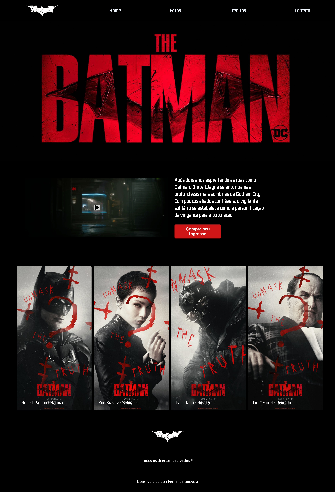

<h1 align="center"> Batman 2022 </h1>

Este site foi feito inspirado no filme The Batman (2022). 

  <a href="#-tecnologias">Tecnologias</a>&nbsp;&nbsp;&nbsp;|&nbsp;&nbsp;&nbsp;
  <a href="#-projeto">Projeto</a>&nbsp;&nbsp;&nbsp;

 

  

## 🚀 Tecnologias

Esse projeto foi desenvolvido com as seguintes tecnologias:

- HTML e CSS
- Git e Github
- Figma

## 💻 Projeto

Este site é uma simulação, inspirada no filme The Batman (2022). Aqui você encontra uma experiência imersiva com sinopse, trailer, elenco, fotos e até uma área fictícia para compra de ingressos. Um projeto feito para explorar e aprimorar minhas habilidades em desenvolvimento web! 

- [Acesse o projeto finalizado, online](hhttps://filmebatman.netlify.app)

- [Acesse o projeto finalizado, no github](https://zugouveia.github.io/filmebatman/)

---
 

    Esse é o meu primeiros projetos 🖤

